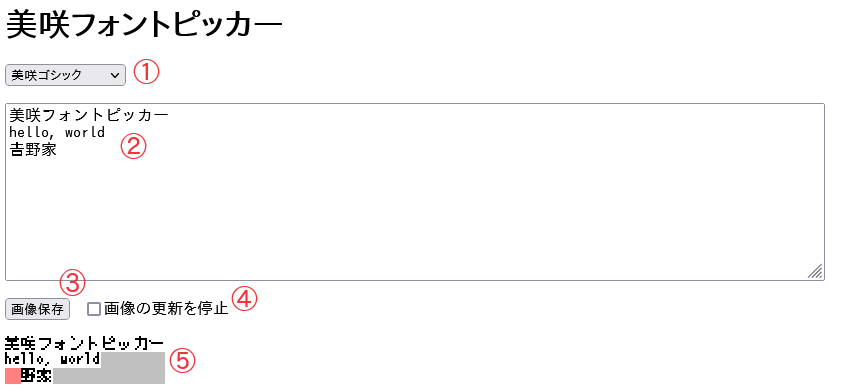
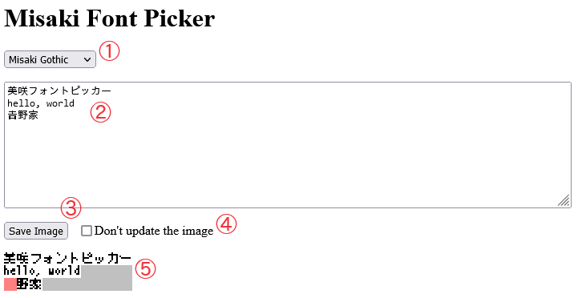

美咲フォントピッカー
====================

[8×8ドット日本語フォント「美咲フォント」](https://littlelimit.net/misaki.htm)から指定の文字だけを抜き出した画像を作ります。  
一部の文字だけを使って表示を行う際、その文字だけを埋め込むのに役立ちます。

## 使い方

1. フォント選択  
   画像に使用するフォントを選択します。
2. 文字列入力  
   抜き出す文字を表す文字列を入力します。
3. 画像保存ボタン  
   抜き出した結果の画像を保存します。
4. 画像の更新を停止  
   チェックを入れると、文字列の入力やフォントの選択を画像に反映しなくなります。
   長文を入力する際など、入力途中の無駄な更新が気になるときに便利です。
5. 画像プレビュー  
   抜き出した結果の画像を2倍に拡大して表示します。  
   行末より後の、文字がない部分はグレーになります。  
   対応する位置が登録されていない文字の部分は赤になります。

---

Misaki Font Picker
==================

This tool generates images by picking specified characters from [8×8-dot Japanese font "Misaki Font"](https://littlelimit.net/misaki.htm).  
This tool should be useful to embed only subset of characters to use for displaying.

## Usage

1. Font selector  
   You can select the font to use for the image here.
2. String field  
   You can enter your string that specifies characters to extract here.
3. "Save Image" button  
   You can save your extracted image using this.
4. Don't update the image  
   Turning on this checkbox prevents updates of image on entering strings and selecting fonts.
   This is useful to avoid wasteful updates while you are entering long texts, for example.
5. Image preview  
   Your extracted image is shown here, magnified by two.  
   Areas after the end of lines that don't have characters are painted in gray.  
   Areas for characters that don't have corresponding positions registered are painted in red.
